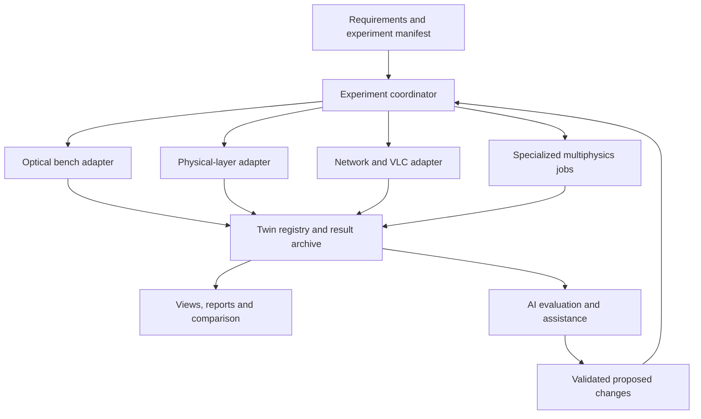

# jfxoss — OpenTwin AI Optics Simulation Platform

> An open-source-oriented integration architecture for optical benches,
> fiber communications, optical networks, visible-light communications,
> multiphysics research and AI-assisted engineering.

## Description and Scope

jfxoss consolidates the original optics technology survey into a modular
architecture connecting requirements, geometry, physical models, network
experiments, observations and reproducible results. It supports research,
education and engineering analysis through replaceable adapters.

**Status:** this repository currently contains documentation. The architecture,
adapters, schemas and MVP below are proposed work, not an executable integrated
distribution. Third-party capabilities are distinguished from jfxoss
implementation status. Sources were reviewed on 2026-09-20.

## Objectives

- Connect MBSE requirements to optical models, experiments and verification.
- Keep bench, waveform, network and multiphysics models independently replaceable.
- Support reproducible simulations and observation-linked digital twins.
- Add AI assistance through bounded tools and physics-based evaluation.
- Preserve source, license, parameter, dataset and result provenance.
- Offer an open execution baseline while identifying optional runtime restrictions.

## Integration Architecture



| Layer | Responsibility | Candidate resources |
| --- | --- | --- |
| MBSE and configuration | Requirements, assumptions, component identities and experiment versions | Arcadia/Capella, versioned manifests |
| Bench and geometry | Optical layout, geometry and beam-state presentation | Blender Optics Simulator, Gaussian Beam Simulator, Hipnos |
| Physical layer | Sampled optical/electrical signals, components and propagation | Optcom, OptiCommPy, Opticomlib, GNLSE, qualified Optilux/Robochameleon profiles |
| Network layer | Topology, service requests, discrete events and link-quality evaluation | FUSION, GNPy, OptiNetSim |
| VLC/LiFi | Hardware observations, link/network models and mobility scenarios | OpenVLC, hybrid LiFi-WiFi project, Arduino/ns-3 reference |
| Specialized physics | Separate plasma and material-interaction simulations | OSIRIS, laserbeamFoam |
| Twin and evidence | Configuration, observations, results, uncertainty and provenance | Proposed OpenTwin Optics registry and archive |
| AI and experience | Tool-assisted setup, literature retrieval, comparison and bounded optimization | Proposed AI gateway, notebooks and visualization clients |

The baseline starts with batch jobs and versioned files. Live co-simulation
is optional and requires an explicit clock and coupling contract. A visually
plausible Blender render is not a physical validation result. A Gaussian-beam
model, waveform solver, network event engine and particle-in-cell code
operate at different abstraction levels and are not interchangeable.

## Model and Digital Twin Boundaries

A virtual model becomes a connected digital twin only when associated with
an identified bench, component, fiber link or network, with configuration
correspondence and time-aligned observations. Simulation-only runs remain
clearly labeled as virtual experiments.

| Twin or model | Canonical information | Evidence |
| --- | --- | --- |
| Optical bench | Component IDs, geometry revision, optical properties and reference frames | Layout provenance and model-domain checks |
| Fiber link | Components, sampled signals, channel configuration and propagation model | Reference waveform/metric comparisons |
| Optical network | Nodes, links, equipment library, services and event history | Topology validation and link-quality assumptions |
| VLC environment | Transmitters/receivers, room geometry, mobility and traffic | Channel-model provenance and observation calibration |
| Device or experiment | Hardware revision, software build, calibration and acquisition metadata | Recorded measurements and uncertainty |
| Specialized physics job | Mesh/grid, material/model inputs, boundary conditions and solver revision | Convergence and benchmark reports |

### Data and adapter contracts

| Contract | Required fields |
| --- | --- |
| Identity | Model/component/run IDs, source revision, license and configuration hash |
| Geometry | Units, frame, axis conventions, orientation and geometry version |
| Optical state | Wavelength/frequency convention, polarization basis and power normalization |
| Sampled signal | Complex-field convention, time grid, sample rate, channel/polarization axes and amplitude units |
| Metrics | Name, definition, units, estimation method and measurement bandwidth where relevant |
| Network event | Event ID, simulation time, node/link/service references and producer |
| Observation | Acquisition timestamp, sensor/calibration ID, quality flag and uncertainty |
| Result | Inputs, seed, solver/version, outputs, assumptions, validity domain and evidence links |

Distinguish optical carrier frequency from sampled envelope frequency, field
amplitude from power, linear units from dB/dBm, and spectral density from
integrated noise. OSNR values require their reference bandwidth; BER values
require sample size and estimation assumptions. A similarly named field in
two tools is not automatically semantically equivalent.

Proposed adapters expose configure, validate, run, status, cancel and
export-results operations. Checkpoint/restart and interactive stepping are
optional capabilities, not universal requirements. Each backend remains the
authority for its own numerical state.

## Cross-Domain Integration

| Connection | Proposed exchange | Validation boundary |
| --- | --- | --- |
| Blender bench to analytical model | Geometry and qualified optical parameters | Scene scale, element conventions and supported physics |
| Waveform tools to comparison service | Canonical sampled arrays and metric definitions | Resampling, polarization, power normalization and bandwidth |
| Physical-layer study to network study | Versioned link-quality tables or calibrated reduced models | Validity envelope; no per-packet waveform simulation assumed |
| FUSION to GNPy | Candidate event/topology-to-quality adapter | Equipment mapping, request semantics, caching and invalidation |
| OptiNetSim to GNPy | Upstream integration already described by OptiNetSim | Pin compatible versions; do not present this as a new independent physical solver |
| LiFi model to ns-3 experiment | Mobility, traffic and qualified channel abstractions | Time base, packet metrics and model fidelity |
| OpenVLC to twin | Recorded device/link observations | Hardware/firmware revision and calibration |
| OSIRIS or laserbeamFoam to archive | Offline datasets and derived metrics | Separate physics domains, units, discretization and model assumptions |

No direct OSIRIS-to-fiber-solver or laserbeamFoam-to-network coupling is
claimed. Such workflows would require a separately justified physical model
and validation plan.

## AI-Assisted Engineering

AI supports engineers by proposing experiment configurations, retrieving
versioned documentation, preparing comparison reports and inspecting results.
Numerical solvers and reference data remain the evidence for physical claims.

| AI service | Inputs and outputs | Evaluation |
| --- | --- | --- |
| Engineering RAG | Source documents and model metadata to cited explanations | Source/version attribution and retrieval accuracy |
| Experiment assistant | Requirements to schema-valid proposed configurations | Parameter bounds, capability checks and reproducible change history |
| Bench tool assistant | Selected scene/state tools to logged layout edits | Dry-run or preview, model checks and reversible scene versions |
| Surrogate model | Qualified solver/measurement datasets to approximate outputs | Held-out error, domain coverage, uncertainty and fallback |
| Network optimization research | Synthetic traffic/topology to candidate resource allocations | Compare with deterministic baselines; report fairness and robustness |
| Anomaly analysis | Observations and quality metadata to inspection suggestions | False positives, calibration drift and human review |

The reviewed Blender Optics Simulator exposes an MCP bridge. Treat its tools
as a versioned upstream interface: inspect actual available operations,
validate arguments and record changes. A jfxoss MCP adapter is still proposed.
Begin with local synthetic scenes and recorded data; physical bench actuation
is a separate implementation scope.

Keep AI prompts, model versions, datasets and accepted changes in the run
record. Do not count rendered images or fluent AI explanations as verification.
Separate training/evaluation data and label surrogate outputs as approximate.

## Categorized Technology Compendium

All entries are optional candidates or research references. Source links
identify projects; inclusion does not imply a tested jfxoss adapter,
maintenance guarantee, unrestricted license or hardware compatibility.

### 1. Optical benches, geometric and Gaussian optics

| Resource | Role | Qualification |
| --- | --- | --- |
| [Blender Optics Simulator](https://github.com/emircbngl/blender-optics-simulator) | Physics-aware optical bench, beam-state views and upstream MCP interface | Reviewed project describes ray, Gaussian and polarization models with selected checks; qualify each supported model and Blender version rather than generalizing “physics-checked” to all optics |
| [Interactive Gaussian Beam Simulator](https://github.com/visuphy/Gaussianbeam) | Browser-based Gaussian-beam propagation and CSV export | ABCD formalism; apply within its model assumptions, not as a full-wave solver |
| [Hipnos](https://github.com/timbz/Hipnos) | Gaussian/Fourier beamline simulation research reference | Thesis-era software with Qt 4/VTK 5 dependencies; modernization and build qualification required |

### 2. Fiber communications and physical-layer components

| Resource | Role | Qualification |
| --- | --- | --- |
| [Optilux](https://github.com/isman7/optilux) | Communication-system algorithms and propagation/DSP reference | Reviewed snapshot is a MATLAB/Octave toolbox under GPLv3; qualify the exact version and MEX/Octave compatibility |
| [Optcom](https://github.com/optcom-org/optcom) | Port-connected optical/electrical component simulation in Python | Model coverage, units and dependency compatibility require profile-specific tests |
| [OptiCommPy](https://github.com/edsonportosilva/OptiCommPy) | Fiber communication systems, components and receiver DSP | Separate CPU/GPU environments and waveform conventions |
| [Opticomlib](https://github.com/armando-palacio/opticomlib) | Python optical/electrical signal objects and electro-optic components | Translate signal semantics explicitly; not interchangeable with similarly named Optcom or OptiCommPy |
| [Robochameleon](https://github.com/dtu-dsp/Robochameleon) | Component/DSP framework for simulation and experimental analysis | MATLAB-based profile with GPLv3 indication; source openness does not remove the proprietary runtime dependency |

### 3. Nonlinear propagation

| Resource | Role | Qualification |
| --- | --- | --- |
| [GNLSE / gnlse-python](https://github.com/WUST-FOG/gnlse-python) | Generalized nonlinear Schrödinger equation modeling for optical fibers | Record grids, material/model parameters and solver convergence; not a general plasma or network simulator |

### 4. Optical networks and service-level simulation

| Resource | Role | Qualification |
| --- | --- | --- |
| [FUSION](https://github.com/SDNNetSim/FUSION) | Discrete-event Software-Defined Elastic Optical Network research | Includes upstream RL integration; define event semantics and evaluation baselines |
| [OptiNetSim](https://github.com/OptiNetSim/OptiNetSim-backend) | Topology/equipment/service management with GNPy-backed analysis | README labels it under development; verify implemented features and backend/frontend versions |
| [GNPy](https://github.com/Telecominfraproject/oopt-gnpy) | Optical route planning and physical-quality estimation | Equipment and propagation assumptions must accompany outputs; not a substitute for sampled waveform analysis |

### 5. Visible-light communications and hybrid LiFi-WiFi

| Resource | Role | Qualification |
| --- | --- | --- |
| [OpenVLC](https://github.com/openvlc/OpenVLC) | Open hardware/software VLC platform and measurement reference | Reviewed design uses BeagleBone Black, cape, driver and firmware; select compatible revisions rather than assuming generic Arduino support |
| [Hybrid LiFi-WiFi System](https://github.com/Logine-Ahmed/Li-Fi-project) | Mobility, load balancing, throughput, energy and switching research models | Mixed project artifacts and analytical/Python descriptions; qualify implementations, units and license before adoption |
| [Li-Fi Circuit and Simulation](https://github.com/Raikenn/LIFI-Circuit-and-Simulation) | Requested Arduino sender/receiver and ns-3 topology-testing reference | README is minimal; inspect circuit/software artifacts, simulator version and license before claiming reproducibility or a working adapter |

### 6. Plasma and laser–material multiphysics

| Resource | Role | Qualification |
| --- | --- | --- |
| [OSIRIS](https://github.com/osiris-code/osiris) | Particle-in-cell plasma simulation research candidate | Distinct from optical-network models; qualify selected relativistic/electromagnetic configuration and HPC requirements. Reviewed repository includes AGPLv3 license text |
| [laserbeamFoam](https://github.com/laserbeamfoam/LaserbeamFoam) | VOF-based laser–substrate interaction and manufacturing research | OpenFOAM-family solvers with specific phase-change/material assumptions; pin supported solver branch/toolchain, not a generic free-space beam propagator |

### 7. Integration and AI support

| Component family | Proposed use | Status |
| --- | --- | --- |
| Arcadia / Capella | Requirements and system architecture | Engineering workflow candidate |
| Python scientific ecosystem | Adapters, comparisons and report generation | Pin per-backend environments |
| MCP / typed service APIs | Bounded AI-to-tool operations | Upstream Blender bridge exists; jfxoss gateway proposed |
| Versioned JSON and array datasets | Configuration and numerical exchange | Canonical schema and storage format to implement |
| Open ML frameworks and experiment tracking | Surrogates, anomaly evaluation and provenance | Optional; choose only after data and validation criteria exist |

## Licensing and Component Admission

Maintain a manifest with upstream URL, fork relationship, exact revision,
code/data/asset licenses, runtime, tested platform, adapter schema, fidelity
limits and evidence. Check dependencies separately from top-level code.

A proposed libre baseline can use qualified Python tools, Blender and browser
visualization. Optilux's documented Octave path is a candidate, not a tested
compatibility promise. Keep MATLAB-dependent Robochameleon workflows in an
optional profile. Review GPL/AGPL obligations and hardware/design licenses
for the actual intended distribution; public hosting alone is not a license.

Track cataloged, implemented, integration-tested and validated-for-a-named-use
states separately. This README update establishes only the catalog and design.

## MBSE → CAD → CAM → CAS

Preserve the original engineering organization:

- **MBSE:** Arcadia/Capella requirements, system context and logical/physical architecture.
- **CAD:** Optical layouts, component geometry and mechanical packaging.
- **CAM:** Manufacturing and assembly planning artifacts where applicable.
- **CAS:** End-to-end simulation, comparisons and verification reports.

Link each requirement to a model configuration and verification result.
Manufacturing geometry, render geometry and numerical model geometry may
differ; record transformations and simplifications rather than treating them
as identical.

## Proposed Repository Structure

The following is a target layout, not a claim that these modules exist.

```text
jfxoss/
  README.md
  MBSE/
    CAD/
    CAM/
    CAS/
  schemas/
  models/
  adapters/
    bench/
    physical_layer/
    networks/
    vlc/
    multiphysics/
  ai/
  twins/
  experiments/
  datasets/
  verification/
  docs/
```

## MVP and Roadmap

1. Define schemas, model manifests and one reproducible experiment package.
2. Implement one Gaussian/bench profile and one Python fiber-link profile.
3. Add a result archive and comparison reports with units and uncertainty.
4. Evaluate a network profile using GNPy; qualify FUSION exchange separately.
5. Import recorded VLC observations and a synthetic mobility scenario.
6. Add read-only AI retrieval, then reversible simulation configuration tools.
7. Evaluate specialist HPC jobs and surrogates only with appropriate references.

MVP acceptance requires a reproducible run from a pinned environment,
machine-readable inputs/outputs, provenance, baseline comparison and a clear
failure report for unsupported configurations. It does not require every
catalog entry to be installed.

## Verification Plan

| Area | Required evidence |
| --- | --- |
| Bench models | Selected analytical reference cases, element conventions and geometry-scale checks |
| Waveform propagation | Resolution/step sensitivity, known limiting cases and power normalization |
| Communications metrics | Consistent noise bandwidth, BER estimation and sample-size assumptions |
| Network models | Traffic seeds, event ordering, topology validity and baseline comparisons |
| VLC observations | Device/calibration provenance and controlled comparison with model predictions |
| Multiphysics | Domain-specific benchmarks, mesh/grid convergence and declared approximations |
| AI | Held-out evaluation, failure cases, uncertainty and reproducible accepted changes |
| Integration | Schema rejection, unit/frame conversions, timeout/cancellation and replay |

Cross-tool agreement is useful evidence but not proof of correctness when
tools share assumptions or source models. Specify tolerances before comparing
results and document known limitations.

## Getting Started

```bash
git clone https://github.com/robotics-intelligent-systems/jfxoss.git
cd jfxoss
```

This currently retrieves the architecture documentation. Choose one profile,
pin its upstream requirements, implement its adapter and record validation
before presenting it as an integrated feature. No aggregate installation or
simulation command is supplied because the proposed runtime does not yet exist.

## Contribution and Project License

Contributions should describe the intended use, source/revision, interfaces,
license implications, model assumptions, verification method and limitations.
Keep external assets and datasets attributable and retain their licenses.

Maintained under the Robotics Intelligent Systems organization. The repository
currently does not supply a project LICENSE file in its reviewed tree; an
explicit license decision is needed before representing new project code as
licensed open source. Third-party licenses remain independent.

## Documentation Validation

This update categorizes the supplied compendium and defines integration and
AI workflows. Upstream descriptions were reviewed; no solver builds, hardware
tests, numerical experiments or implemented adapters are claimed.
